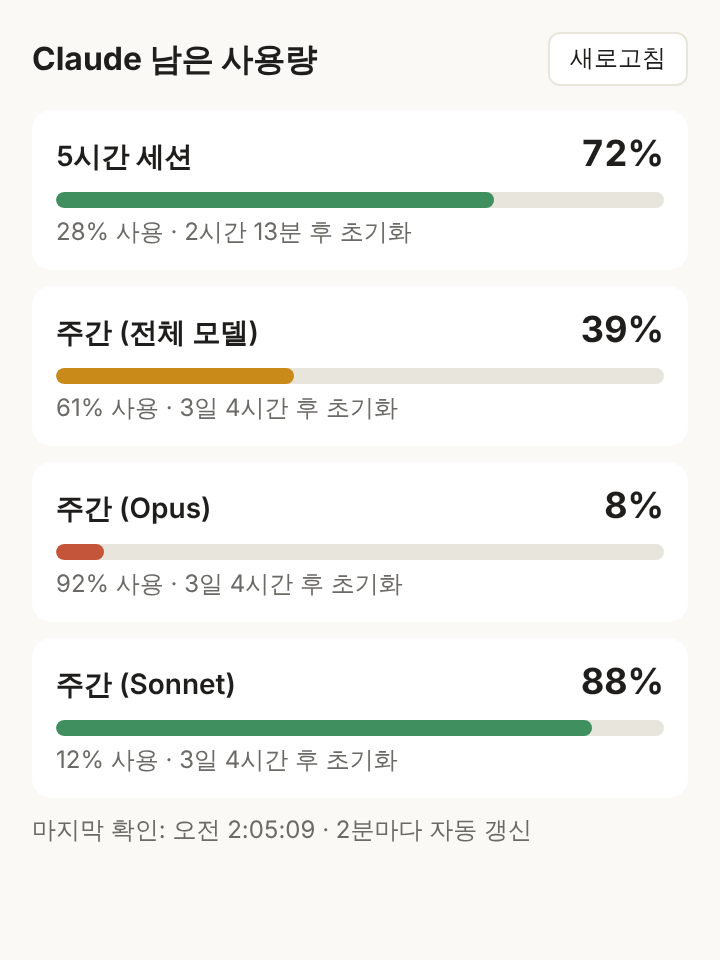

# Claude Usage Widget

메뉴바에서 **Claude 사용량이 얼마나 남았는지** 바로 보여주는 작은 앱이에요.
Claude Pro / Max 구독의 **5시간 세션 한도**와 **주간 한도**가 몇 % 남았는지, 언제 초기화되는지 알려줍니다.

```
메뉴바:  ◔ 5h 72% · 7d 39%

클릭하면:
  5시간 세션: 72% 남음 (28% 사용)
      2시간 13분 후 초기화
  주간 (전체 모델): 39% 남음 (61% 사용)
      3일 4시간 후 초기화
  주간 (Sonnet): 88% 남음 (12% 사용)
      3일 4시간 후 초기화
  마지막 확인: 13:05 · claude.ai 로그인
  ─────────────
  지금 새로고침
  자세히 보기…
  claude.ai 로그아웃
  ✓ 로그인 시 자동 실행
  ─────────────
  종료
```



- 지원: **macOS 11+** (Apple Silicon / Intel 공용), Windows (실험적)
- macOS 14 (Sonoma) 이상에서는 **바탕화면 위젯**으로도 볼 수 있어요.
- 2분마다 자동으로 갱신돼요.
- 사용량을 *조회*만 하므로 Claude 사용량을 소모하지 않아요.

## 필요한 것

Claude Pro / Max 구독 계정만 있으면 돼요. 로그인 방법은 둘 중 하나예요.

- **claude.ai로 로그인 (누구나):** 앱을 처음 켜면 claude.ai 로그인 창이 떠요. 평소처럼 로그인하면 끝이에요. 메뉴의 **claude.ai로 로그인…** 으로 언제든 다시 열 수 있어요.
- **Claude Code (설정 없이 자동):** [Claude Code](https://docs.claude.com/en/docs/claude-code)에 로그인되어 있다면 아무것도 하지 않아도 그 로그인 정보로 바로 동작해요.

둘 다 있으면 claude.ai 로그인을 우선 사용해요. API 키는 필요 없어요.

## 설치 (macOS)

1. [Releases](https://github.com/smtodj/claude-usage-widget/releases/latest) 페이지에서 `Claude.Usage_x.y.z_universal.dmg`를 받아요.
2. dmg를 열고 **Claude Usage**를 `응용 프로그램` 폴더로 끌어다 놓아요.
3. 아직 Apple 공증(notarization)을 받지 않은 앱이라 처음 실행할 때 macOS가 막을 수 있어요. 터미널에서 아래 명령을 한 번 실행한 뒤 앱을 여세요.

   ```sh
   xattr -dr com.apple.quarantine "/Applications/Claude Usage.app"
   ```

   또는 Finder에서 앱을 **우클릭 → 열기**를 선택해도 돼요.
4. 메뉴바에 게이지 아이콘과 `5h 72% · 7d 39%` 같은 숫자가 나타나면 성공이에요. Dock에는 아이콘이 생기지 않아요.
5. 로그인할 때마다 자동으로 켜지게 하려면 메뉴에서 **로그인 시 자동 실행**을 체크하세요.

### 바탕화면 위젯 (macOS 14+)

1. 앱을 `응용 프로그램` 폴더에 넣고 한 번 실행해요.
2. 바탕화면 빈 곳을 **우클릭 → 위젯 편집…** 을 눌러요.
3. 목록에서 **Claude Usage**를 찾아 작은 크기나 중간 크기 위젯을 바탕화면에 끌어다 놓아요.

위젯은 메뉴바 앱이 읽어 온 값을 보여줘요. 메뉴바 앱이 꺼져 있으면 값이 갱신되지 않으니 **로그인 시 자동 실행**을 켜 두세요. 위젯을 처음 놓은 뒤 숫자가 뜨기까지 최대 2분 정도 걸릴 수 있어요.

처음 실행할 때 "키체인 접근 허용" 창이 뜨면 **항상 허용**을 눌러 주세요. 로그인 정보를 키체인에 저장하고 읽기 위한 것이에요.

## 설치 (Windows, 실험적)

[Releases](https://github.com/smtodj/claude-usage-widget/releases/latest)에서 `Claude.Usage_x.y.z_x64-setup.exe`를 받아 설치하세요.
Windows는 작업 표시줄 트레이에 숫자를 표시할 수 없어서, 트레이 아이콘에 마우스를 올리거나 클릭하면 남은 양이 보여요.

## 동작 방식

**claude.ai 로그인을 쓸 때**
- 앱 안의 창에서 claude.ai 로그인 페이지를 열고, 로그인이 끝나면 claude.ai가 설정하는 `sessionKey` 쿠키를 OS 보안 저장소(macOS 키체인, Windows 자격 증명 관리자)에 저장해요. 비밀번호는 claude.ai 페이지에 직접 입력하므로 앱은 볼 수 없어요.
- claude.ai 설정 → 사용량 화면과 같은 `GET https://claude.ai/api/organizations/{조직ID}/usage`를 호출해요.
- 로그인 쿠키는 몇 주 뒤 만료될 수 있어요. 그러면 메뉴에 안내가 뜨고, **claude.ai로 로그인…** 을 다시 누르면 돼요.

**Claude Code를 쓸 때**
- Claude Code의 `/usage` 명령이 쓰는 엔드포인트 `GET https://api.anthropic.com/api/oauth/usage`를 호출해요.
- 인증 토큰은 다음 순서로 찾아요.
  1. 환경 변수 `CLAUDE_USAGE_TOKEN` (직접 지정하고 싶을 때)
  2. macOS 키체인의 `Claude Code-credentials` 항목
  3. `$CLAUDE_CONFIG_DIR/.credentials.json` 또는 `~/.claude/.credentials.json`
- 토큰은 **읽기만** 하고 갱신하거나 저장하지 않아요. 토큰 갱신은 Claude Code가 담당하기 때문에, 이 앱이 건드리면 Claude Code 로그인이 풀릴 수 있어서예요.

어느 방식이든 로그인 정보는 Anthropic(claude.ai / api.anthropic.com) 외의 어디로도 전송되지 않아요.

> ⚠️ 두 엔드포인트 모두 Anthropic이 공식 문서로 공개한 API가 아니에요. 언제든 바뀔 수 있고, 바뀌면 앱이 오류를 표시해요. 이 프로젝트는 Anthropic과 관련이 없는 비공식 도구예요.

## 문제 해결

| 메뉴에 보이는 메시지 | 해결 방법 |
| --- | --- |
| 로그인이 필요해요 | 메뉴에서 **claude.ai로 로그인…** 을 누르세요. |
| claude.ai 로그인이 만료됐어요 | 메뉴에서 **claude.ai로 로그인…** 을 다시 누르세요. |
| 토큰이 만료됐어요 / 인증에 실패했어요(401) | Claude Code 토큰은 몇 시간마다 만료되고, Claude Code를 쓸 때 자동으로 갱신돼요. 터미널에서 `claude`를 한 번 실행한 뒤 **지금 새로고침**을 누르세요. |
| Keychain: ... | 키체인 접근을 거부한 경우예요. 앱을 다시 실행하고 **항상 허용**을 눌러 주세요. |
| 요청이 너무 많아요(429) | 잠시 기다리면 다음 자동 갱신 때 다시 시도해요. |
| 위젯 목록에 Claude Usage가 없어요 | 앱이 `응용 프로그램` 폴더에 있는지 확인하고, 앱을 한 번 실행한 뒤 위젯 편집을 다시 열어 보세요. |

## 직접 빌드하기

필요한 것: [Rust](https://rustup.rs) (stable), [Node.js](https://nodejs.org) 20+. 바탕화면 위젯까지 빌드하려면 Xcode와 [XcodeGen](https://github.com/yonaskolb/XcodeGen)도 필요해요.

```sh
git clone https://github.com/smtodj/claude-usage-widget
cd claude-usage-widget
npm install
sh macos/build-widget.sh   # macOS: 위젯을 macos/build/에 빌드 (설치 파일 만들 때 필요)
npm run dev        # 개발 모드로 실행
npm run build      # 설치 파일 생성 (target/release/bundle/)
```

터미널에서 사용량만 확인해 보고 싶다면:

```sh
cargo run -p usage-core --example usage
```

## 프로젝트 구조

```
crates/usage-core/   토큰 읽기, API 호출, 응답 해석 (플랫폼 공통 Rust 라이브러리)
src-tauri/           메뉴바/트레이 앱 (Tauri 2)
ui/                  "자세히 보기" 창 (HTML/CSS/JS)
macos/widget/        macOS 바탕화면 위젯 (Swift, WidgetKit)
.github/workflows/   CI, 태그 푸시 시 릴리스 빌드
```

## 새 버전 배포하기

1. `src-tauri/tauri.conf.json`, `Cargo.toml`, `package.json`의 버전을 올려요.
2. 태그를 푸시하거나 Actions에서 **Release** 워크플로를 실행하면 GitHub Actions가 macOS(universal)와 Windows 설치 파일을 빌드해 Releases에 올려요.

   ```sh
   git tag v0.1.0
   git push origin v0.1.0
   ```

## 앞으로의 계획

- [x] macOS 메뉴바
- [x] Windows 트레이 (실험적)
- [x] Claude Code 없이 claude.ai 로그인으로 사용
- [x] macOS 바탕화면 위젯
- [ ] iOS / Android: Tauri 2 모바일 빌드로 `usage-core`와 claude.ai 로그인 창을 재사용하고, 홈 화면 위젯은 각 플랫폼 네이티브(WidgetKit / Glance)로 붙일 예정이에요.
- [ ] 사용량이 일정 비율 아래로 떨어지면 알림

## 라이선스

[MIT](LICENSE)
